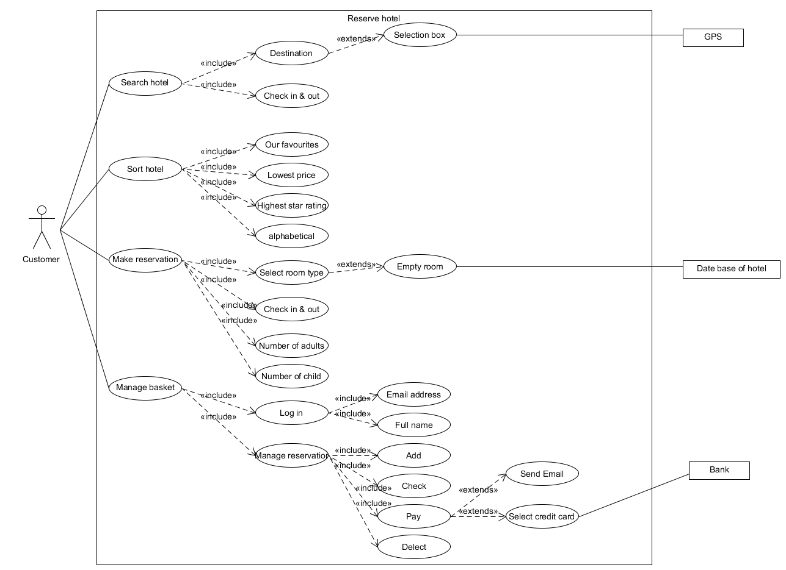
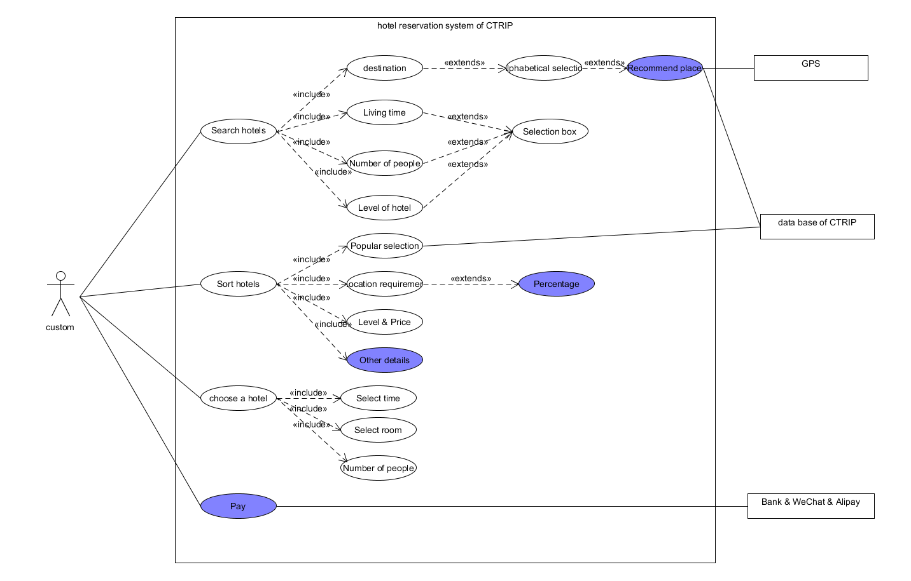

# Homework6
## 简答题
### 1.用例的概念
   + 软件工程或系统工程中对系统如何反应外界请求的描述，是一种通过用户的使用场景来获取需求的技术。
### 2.用例和场景的关系？什么是主场景或 happy path？
   + 所有可能发生的各种情况（包括正常的和异常的）被称之为用例的场景(Scenario)，场景也被称作是用例的实例。
   + 主场景就是用例里最主要的情况。
### 3.用例有哪些形式？
   + 描述需求，便于和用户沟通需求。
   + 描述业务的过程，指导项目开发。
   + 记录需求讨论过程，并最终文档化。
### 4.对于复杂业务，为什么编制完整用例非常难？
   + 用例多，场景多。它们之间的关系很难完美的表达出来。
### 5.什么是用例图？
   + 由参与者（Actor）、用例（Use Case），边界以及它们之间的关系构成的用于描述系统功能的视图。
### 6.用例图的基本符号与元素？
   + 参与者、用例、系统边界、箭头。
### 7.用例图的画法与步骤
   + 确定参与者
   + 确定系统边界和范围
   + 确定用例
   + 将用例细化
### 8.用例图给利益相关人与开发者的价值有哪些？
   + 用例图是由软件需求分析到最终实现的第一步，它描述了参与者如何使用一个系统。用例视图显示谁是相关的用户、用户希望系统提供什么样的服务，以及用户需要为系统提供的服务，以便使系统的用户更容易理解这些元素的用途，也便于软件开发人员最终实现这些元素。
## 练习建模题

